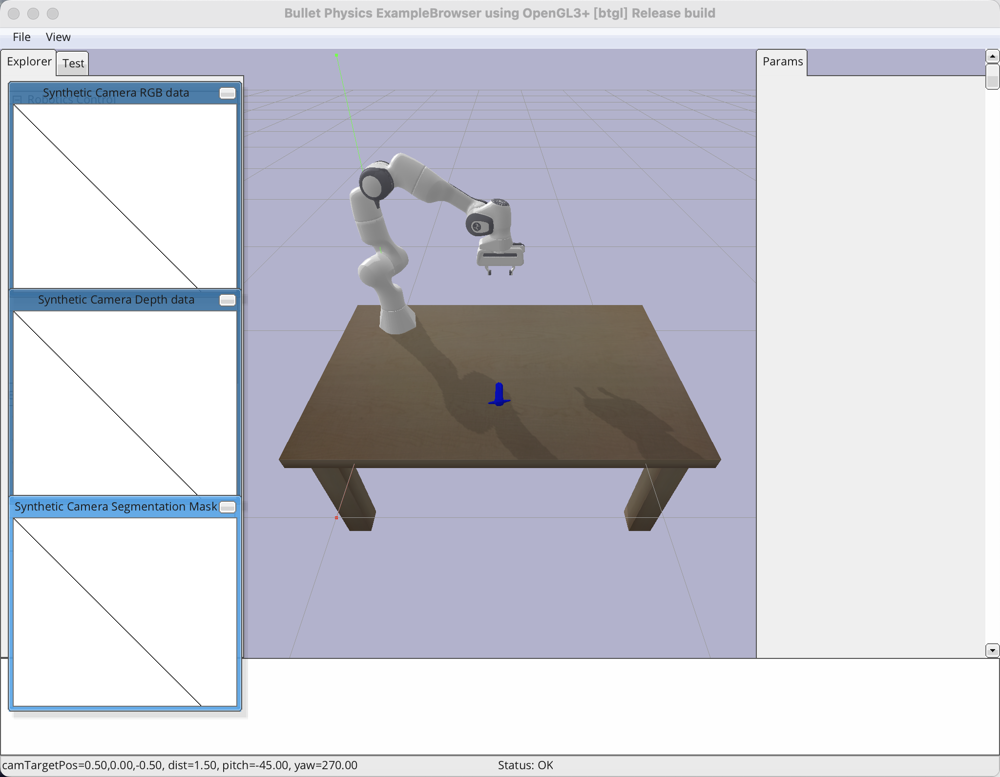

# Simulation of LSTM-based Behavioral Cloning for Robotic Arm.

***Background***: Cheems_JH's personal research mainly focuses on machine learning-based low-level learning from demonstration (like DMP). However, modern learning from demonstration also relies on advanced neural network techniques such as behavior cloning or inverse reinforcement learning. Therefore, after gaining rough understandings about behavior cloning and neural network, Cheems_JH aims to implement a behavior cloning-based robotic arm learning from demonstration in simulations. The general objective is to teleoperate the robotic arm to perform a grasping task and obtain the demo, then use behavior cloning to imitate the demo.

***Environment***: 2024 MacBook Air M3, pycharm + python 3.12 + pytorch 2.5.1 + pyBullet 3.25.
Since the following codes does not use complex libraries or functions, similar versions of PyTorch and PyBullet should also be compatible. 
As for other libraries, such as those required for interpolation (*scipy*) or excel processing (*openpyxl*), you can install them according to the imports part of each code.

***General Introduction***: This project mainly consists of the following three parts:
- **Data collection** (using the keyboard to control the Emika Panda robotic arm in the PyBullet environment to complete the object grasp task, and collect data during this process as the demonstration;
- **Network training** (constructing a network based on PyTorch to learn the demonstration);
- **Network testing** (using the trained network to drive the Panda robotic arm in PyBullet to check whether it can complete the task like the demonstration).

## 0. Problem Formulation
- Behavior cloning can be considered the most fundamental method of using neural networks for learning from demonstration. Its goal is to find the mapping between demonstrated state-action pairs through supervised learning.
- Specifically, the demonstrations $X$ can be described as sequences of states $s$ and actions $a$, $X=[(s_1,a_1), (s_2,a_2), ... , (s_n,a_n)]$. Then the behavior cloning based on neural networks is to trained the mapping of $S \to A$. Once trained, the network can predict the required action based on the current state, enabling the agent to imitate the demonstration.
- However, this also clearly reveals the limitations of behavior cloning: the dataset struggles to cover the entire task space, resulting in poor generalization or requiring a large amount of demo for good generalization. This leads to the phenomenon of "error accumulation" in behavior cloning—if the predicted action is worse, it may lead to a rare state in the next timestep, which in turn causes even worse action predictions.

To simplify the simulation, Cheems_JH considered **a object grasping task with a fixed initial state of the robotic arm and a fixed target object position**. 
Based on this, the following dataset format was chosen: during the teleoperated demonstrations of the robotic arm, only the gripper's position and its open/close state were recorded. This way, **the gripper's position and open/close state and the position of object at the current time step can be used as the state**, while **those at the next time step can be treated as the action**. When apply the trained network, the current gripper position and open/close state can be sampled as input, and the network predicts the required action (gripper position and open/close state) for the next time step, then the robotic arm is controlled via inverse kinematics to transition to the predicted action.

## 1. Get Demonstrations in Simulation
> Code: /codes/pybullet_get_demonstration.py

This code constructs a simulation environment in PyBullet where a Panda robotic arm performs object grasping on a tabletop, as shown in the figure below. You can control the robotic arm using the keyboard. The control principle is primarily based on inverse kinematics, adjusting the gripper's position while keeping its orientation fixed. During keyboard control, the gripper's position $(P_gx, P_gy, P_gz)$, the target object's position $(P_ox, P_oy, P_oz)$, and the gripper's open/close state $S_g = 1 or 0$ are recorded at a frequency of 10 Hz. 

  

The usage process of this code is as follows:

[1] Running the code, wait for the robotic arm to move to the initial position and stabilize.

[2] Press the "q" key to start collecting the demonstration, then robotic arm can be controlled via the keyboard.

[3] Use the "w,a,s,d" keys to control the horizontal movement of the robotic arm's end effector, the "z,x" keys to control the height, and the spacebar to control the gripper's closing.

[4] After completing the task, press the "e" key to stop collecting the demonstration and exit the code. The collected demonstration will be saved as an Excel file in the code directory with the name "demo+time.xlsx", as shown in the folliwing figure.

  

## 2. Behavioral Cloning of Demonstrations based on Neural Networks
## 3. Test the Trained Behavioral Cloning Model in Simulation
